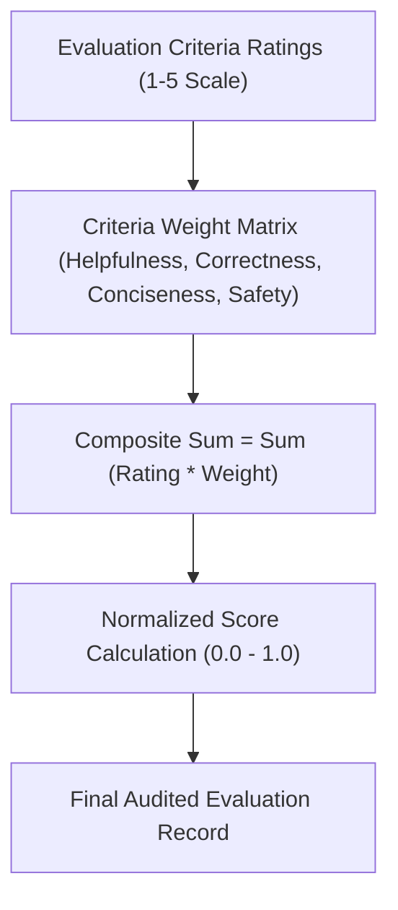

# genpark-llm-as-a-judge-rubric-scoring-engine-skill

Agent Skill implementing **LLM-as-a-Judge Weighted Rubric Evaluation** in 100% Python standard library.

## Architectural Flow

```mermaid
flowchart TD
    Criteria["Evaluation Criteria Ratings (1-5 Scale)"] --> Weights["Criteria Weight Matrix (Helpfulness, Correctness, Conciseness, Safety)"]
    Weights --> Formula["Composite Sum = Sum (Rating * Weight)"]
    Formula --> Norm["Normalized Score Calculation (0.0 - 1.0)"]
    Norm --> Report["Final Audited Evaluation Record"]
```
